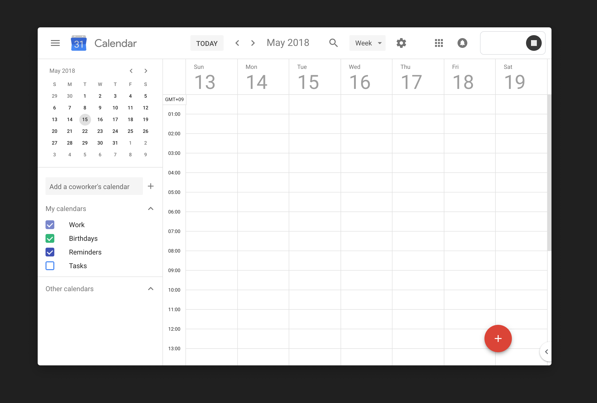

Recently, I felt an odd longing for seasons.

San Francisco has only two: pleasant and foggy. Trees keep their leaves year-round, and temperatures are consistently in the sweater range. It's a city of eternal mild weather.

This past Christmas I went back to Toronto when winter was in full force. My phone told me it was -30°C. The downtown core was like a wind tunnel, blasting my face with high-speed frigid air. _Why does anyone put up with this?_ I thought. But here I am, five months later, sitting in the California sun, longing for some crappier weather.

It's not the Canadian winters that I miss, so much as the natural division of time that seasons bring to the year.

Living in a season-less city makes time move at a scary pace, like how as a kid, summer vacation would end before you know it. Between work, travel, and a few personal projects, weeks pass by in an instant. I've been here for two years, but it's only felt like a couple months.

### The Language of Calendars

Calendars, even informal ones, are one of humanity’s most important thinking tools. From agricultural days it was important to know when in the year to plough, to seed, to harvest and when to let fields lie fallow. Even as societies urbanized, it became important to have standards for time, so you can know when to expect certain weather, demarcate religious days, or even just meaningfully talk about the future.

There’s no shortage of writing about the impact of our mechanization of time, but McLuhan is particularly concise:

> The clock [or calendar, in our case] dragged man out of the world of seasonal rhythms and recurrence, as effectively as the alphabet had released him from the magical resonance of the spoken word and the tribal trap. This dual translation of the individual out of the grip of Nature and out of the clutch of the tribe was not without its own penalties.

Much like written language, the development of a standard calendar enabled a greater degree of coordination and control as a society. And also like written language, calendars have introduced metaphors and patterns of thought which affect how we live. The week, the month, the year, sure. But also the financial quarter, the nine-to-five, the holiday.

We use this language to guide our lives and work.

For instance, my roommates come home from work at larger companies often frustrated with their projects, feeling like they can't make meaningful progress because their work is constrained to the current quarter. The short cadence encourages building products that quickly cater to metrics, rather than bring about more meaningful, holistic change. The chunks of time are too small, too constraining.

The inverse happens every New Year's Eve. People set resolutions that are achievable within a year, but as the days pass, it's easy to lose yourself in how quickly they go by. The cadence for reflection and review is often too long, and the goals become disconnected from everyday experience, nebulous and intangible.

Both of these experiences point to, in part, a failure of how we conceptualize and represent time. The divisions of time we live in often feel quite arbitrary.

Standardized calendars are no doubt great for accounting, communication, and coordination[^1] but they fail at more personal functions like journaling, deep work, or maintaining cycles of interest and curiosity.

### "Phases"

A friend of mine has a unique method of journaling.

He documents moments from his life via a mishmash of words, events, ideas, and screenshots, and groups them into discrete _phases_ in iPhoto. Each phase is roughly two weeks long — but it's defined by his living situation and activities, not the days of the month. A week-long bike trip across Southern Europe might be one phase, but two months of heads-down focus on school work could be another.

It's a great way to remember things. In conversations, a topic or feeling will come up, only for him to say, "oh man, that was _so_ phase 37." By chunking his life out into phases it becomes easier to grasp, both in language and in memory.

Contrast that with a more standard journaling experience: writing a few hundred words every few days. At the end of a month or a year, you look back on a sea of sentences, unfiltered and uncategorized. So much is written that it's hard to extract anything meaningful from it without jumping around to specific days.

By eschewing standard dates for self-defined ones, my friend has inadvertently created a personal, more useful, unit of time: the phase.

### Thinking in Decades

Consider another function of calendars: planning.

You open up Google Calendar and you get a view of the next 7 days. You can block out the next 168 hours of your life in chunks of 30 minute events.

But unless your life is a long series of [back-to-back 30 minute meetings](http://www.paulgraham.com/makersschedule.html) with others, does this interface make sense? Do most people actually live that way?

In contrast, James Fisher's [long calendar idea](https://jameshfisher.com/2017/06/06/long-calendar) sounds really compelling:

> How long will you be in your current house? How do you plan out your thirties? When will you move to Spain, as you’ve always imagined you would? When might you have your first child, and what job would you like to aim for by then? […]   
> These life questions require a different kind of calendar. They operate on a different timescale, where the month is probably the most granular unit of time you might want. These questions work on a personal human epoch — “I am 29”, not “it is 2017.”

How might seeing your whole life, laid out on a single surface affect how you live and plan?

### Small Seasons

In Kenya Hara's book _White_, he briefly talks about _sekki_, small seasons used in ancient agricultural China and Japan to divide the year. Each sekki corresponds to a shift in the climate, not the calendar, with poetic language to match the changes.

Where spring is our "large" season, lasting roughly from March to June, the sekki calendar breaks it down into six small seasons: _start of spring_, _rain waters_, _the going-out of the worms_, _vernal equinox_, _clear and bright_, and _rain for harvests_.[^2] Both describe a similar period of time, but one does so with a precision that feels much more human.

These days, I increasingly find myself using sekki as a calendar for my own phases.

On one hand, it's nice to have a calendar so explicitly based on the surrounding environment; you’re encouraged to look up and notice what's different today, that the crickets are no longer chirping and that time has gone by.

But it also better matches my own ebb and flow of interest, attention, and general mental headspace. Two weeks of deep work on something is a healthy amount before wanting to move on to a different aspect, or a new project all together.

### And Beyond

Sekki, phases, and the long calendar are just a few examples of more human and purposeful calendaring systems. Heck, even [a seasonal vegetable chart](https://cuesa.org/eat-seasonally/charts/vegetables) for an area is an unexpectedly useful time-keeping tool. Why can't your calendar be a tool to help you decide when to make a minestrone soup, oxtail stew, or a pico de gallo?

You can imagine some bigger questions along the same train of thought:

- How can calendars inspire or inform daily living?
- What does a community calendar look like? How can it afford community action and collective identity?
- How can calendars encourage thinking beyond our own lifespans? (Peter Bïlak's [100-year calendar](https://www.typotheque.com/posters/the_100-year_calendar) is an interesting example of this)

Perhaps there's merit to new models and abstractions for breaking time down in different, more human ways. I'm personally interested in more conversation and links about this.[^3]

Especially in an era with such powerful means to represent time, finding novel and meaningful ways of breaking it down seems quite fruitful.

### Further reading

- [Small Seasons](https://smallseasons.guide/)
- [In Search of Personalized Time](http://i-s-o-p-t.com/)
- [A Line Moving Across A Window Once Every Year](https://a-line-moving-across-a-window-once-every-year.com/)
- [Austin Kleon's notes on seasons](https://austinkleon.com/tag/seasons/), including [Seasonal Time](https://austinkleon.com/2017/10/02/seasonal-time/)

[^1]:

  The value of standard calendars is not lost on me. Having recently experienced the joys of programming around [the Ethiopian calendar](https://en.wikipedia.org/wiki/Ethiopian_calendar), I'm _enthusiastically_ in support of alignment to conventions when working with others.

[^2]:

  You can find a [full list of small seasons here](https://smallseasons.guide), a small site built to enshrine this idea.

[^3]:

  If you are too, drop some hot links in this [Alternate Calendars](https://www.are.na/ross-zurowski/alternate-calendars) Are.na channel. I'd love to see more.
