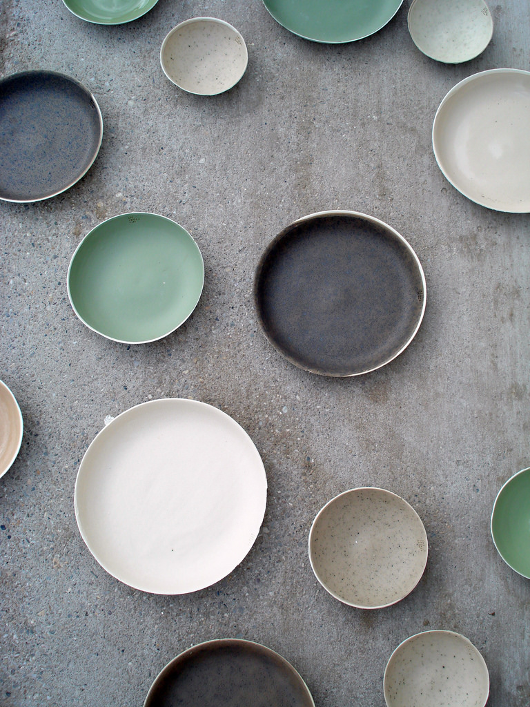
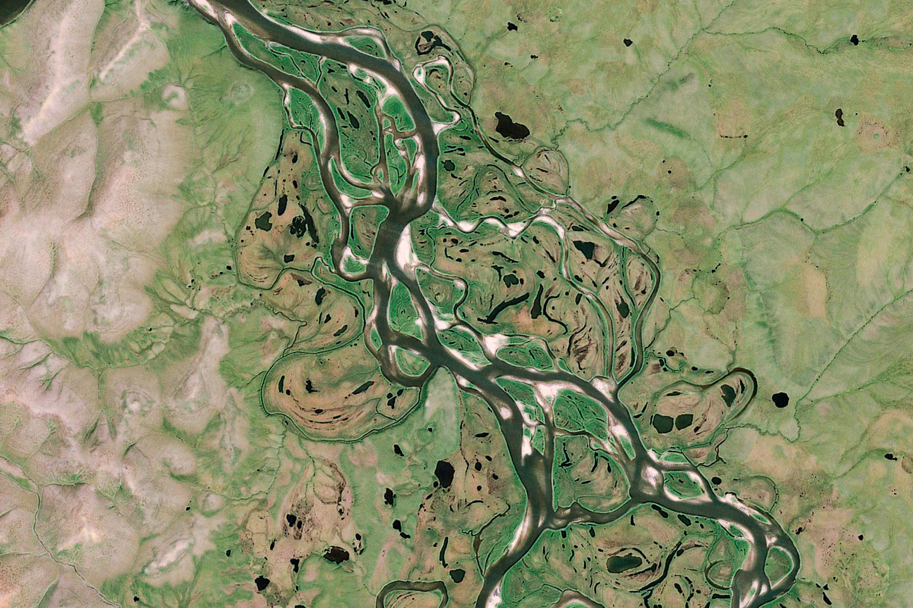

I want to talk about _outlets_, and their utility as a creative tool.

The term is often used as an easy expression, conjuring up an image of a mother frustrated by her children's antics ("she just needs an outlet for her energy!"). I'd like to repurpose it. I've found outlets to be a helpful metaphor for understanding what makes up a healthy and curious life, for mothers and children alike. I'll try to describe the concept in detail here.

---

In ecological terms, an outlet is an opening for a river, letting water out into a larger body. An exit, a vent.

Running water has long been a symbol for life and creativity so the metaphor seems fitting. A river that doesn't flow grows stagnant, so having an outlet is important to sustaining the life around it.

An outlet is a **destination for effort**.[^1]

If we're lucky enough to have them, jobs and projects are good examples of outlets. Each day we sit down and give ourselves to the work of designing for our clients, stocking the shelves at the store, or building tools for others. At their best, jobs and projects challenge us in the work we do and, despite coming home tired, there's a sense of joy in the exertion. 

But outlets take other forms too:

* A physical object like **a journal or a notebook** is an outlet. Its very presence asks to be filled with notes and memories. The act of buying a journal (or a journaling app) can often be the beginning of a long-lived journaling practice.
* Even social spaces like **a friendship or club or community** are outlets, being tended to instead by hangouts, shared meals, and gifts rather than time at a desk. The form which the effort takes is different, but the fact that it's a destination is the same.

Our lives are full of various outlets, and the ones we choose to pour into determine the kind of work we do, and where we head.

When speaking of what I'd call an outlet, friends will often use the word "opportunity." An old friend finally started his own branding studio and is making all kinds of opportunities for himself. Another friend recently told me about her opportunity to design a tattoo for a famous ballet dancer.

I heard once that the root for the word "opportunity" comes from "pore", meaning "an opening", like the pores in your skin.

In many ways outlets too are like an open space. Not only these open spaces draw something out from us, but they also have their own influence on what we fill them with.

---

In learning about  and watching professional researchers do interviews or (eeek) having to conduct them myself, I've learned that there's an art to asking a good question.

A bad question evokes a one-word response, or worse, leaves an audience feeling confused or misunderstood. Even with the most interesting people, bad questions lead to surface-level responses, idle conversation, and people who would rather be somewhere else. But a good question is something else. It's like a fire to crowd around, drawing people in and inviting them to say something. You'd never realize the amount of expertise every single person has until you've watched a well-conducted user interview. "Why do you think your boss hasn't adopted the new format yet?" Bam! A whole essay is coming your way. It's incredible.

A good question is a destination, a space to fill. It asks people to fill it with their knowledge and experience. People have been casually snapping photos ever since the early 1900s with the advent of the $1 Kodak Brownie camera and the first cheap commercial films. As is common in the early days of any media, people weren't quite sure what to do with it. The possibilities were endless: what would they take photos of? Who would the photos be for? The years passed and people explored the possibilities of cameras and photography, and what it might mean. For many people, the photos they took ended up in the family photo album. By the 1950s it was estimated that 55% of all photos ever taken were of babies. The camera would come out at special occasions: birthdays, holidays, family vacations. People began photographing _for_ the family album.

Now, consider Instagram, a common outlet for photography these days.

People who have a place to publish their work will do more work. People who have a tumblr or instagram will take and publish more photos than those who don't. People with a blog will write more than those who don't.

So the idea that an outlet is just a destination, a place to put effort, might sound innocuous. But having a place to put things is important, because a place to put things gives you a _reason_ to make those things. Like a plant pulling water up through its roots, an outlet draws the work out of you.

Of course, outlets don't do the work for you. You still need to sit down and put in the effort. But outlets can be the difference between sitting silently in a room unsure of what to do, and engaging with the world around you.

Everyone [might not have a book in them](https://theoutline.com/post/5541/unconventional-wisdom-you-should-not-write-a-book?zd=1&zi=cfzuoizr), but at the very least everyone has an essay or a poem. There's an infinite abundance to speak about, to paint about, to sing about. But having a place to direct those efforts is a _reason_ for the efforts in the first place. 

So outlets aren't just a destination. In many ways, they're also a starting place.

<!--
Growing up, I had an image of prolific writers and artists as people who, in some Platonic sense, were simply "creative." Inspired by some internal vision of what the world needed, they'd write essays, draw pictures, paint paintings. They'd produce more and more of these things until there was enough for a book or an exhibition. I probably read too much of _The Fountainhead_.

While, in some senses, I suppose that's true, my view has shifted. There's an inversion of my thinking: "People have work to share, so they make a place to put it." More often than not, I find it's actually "I have a place to put things, I'm going to make work to fill it."
-->

---

In high school, several of my friends got interested in lucid dreaming, the practice of dreaming while you're aware of it. Inspired by the film, _[The Waking Life](https://letterboxd.com/film/waking-life/)_, they'd experiment with all sorts of ways to achieve a waking dream. 

One of them, having lived in Africa for a few years when he was younger knew that the easiest way to have a waking dream was _mefloquine_, a malaria medication. However, with mefloquine being replaced by drugs without side-effects (and as students with no plans to go to any sub-tropical country), getting a prescription wasn't going to happen.

Barring medication, the next best thing was keeping a dream journal.

To lucid dream you need to be able to recognize that you're in a dream while it's happening. You have to notice where you are. Normally your brain forgets dreams within a few minutes of waking up. And I suppose after a lifetime of ignoring dreams, your brain gets good at forgetting about them.

To counter-act our tendency to forget, lucid dreamers keep a dream journal where each morning they write down what they dreamt about last night. It starts out difficult. You struggle to recall basic details like where you were, or how many dreams you had. But over time it gets easier and easier.

It's a practice of nudging your brain saying, "hey you, brain, this is important stuff, don't forget it." And your brain picks up on that.

I love this idea because it seems true for so many things.

As a graphic designer, so much of design school felt like the same process. Assignment after assignment helping you to say, "hey, eyes, look out for the odd blobs of whitespace in this poster/typeface/book layout. It's important stuff, don't pass over it." Much of the practice of photography is the same. "hey, eyes, watch out for the color and angle and intensity of light." Like the dream journal, it starts out hard and you miss a lot. This is why the first step of any art is learning to see.

I imagine the same is true for cooking. Until you've tried making a meal for yourself, you won't notice the effort or skill that goes into it. Or singing. The [criticism of one who actually knows what it takes](https://www.youtube.com/watch?v=bVRydgArqUs) goes much further than an outsider, since they know what to look for.

Learning to see, noticing, this is another important quality of outlets. They **focus the world around you**. Snippets of conversation turn into a story idea; light falling on bedsheets becomes a photograph; odd situations in your work life turn into a syllabus. Having an outlet focuses everyday life into discrete forms, and asks you to live more curiously or more reflectively.

Think of a hobby you've been doing for many years. Maybe it's knitting or cooking. Now, imagine someone asked you to teach a class about it.  All of a sudden you have a space to fill, a reason to reflect on your experiences, and a pedagogy to develop.

In a sense, the best way to get better at a certain kind of work seems to be to craft your own outlet for it. After all, making exposes you to the [adjacent possibles](https://www.practicallyefficient.com/2010/09/28/the-adjacent-possible.html) in any field, so choosing your outlets determines the futures you're working towards.

People who produce the most interesting work are often the product of the diversity of their outlets.

---

> _What is it that makes a bowl useful?_ 
> A bowl can carry things, and we can eat or drink out of it. 
> _So we like a bowl because it provides us with other things?_ 
> Well, no. A bowl doesn't actually provide anything that we don't first provide to the bowl. 
> _And the things we provide to the bowl are all that we like about the bowl?_ 
> Well, no. A bowl is empty, capable of holding things. 
> _So we like a bowl because of what is not there? Because the middle of a bowl is not bowl?_ 
> Yes. We like a bowl because of what is not there.

Like how every bowl has a shape, over time, each outlet over time gains a sort-of character.

Returning to the Instagram example, not only are more photos taken, but more photos of a certain type are taken. The small screens photos are viewed on, and the low-resolution cameras the service started with has tended towards a kind of photography known for simple shapes and compositions. Big blocks of color, large areas of shadow, colourful… ice cream. Instagram as an outlet has its own affordances, and has feedback mechanisms in place which favour a certain kind of photo.

Other photo communities too have a different character. Flickr was chock full of people documenting old books and artifacts, 500px tended towards HDR shots and landscapes.

Even a blog you might start will begin to take on a certain voice & tone that shapes what comes afterwards. A friend you always talk about work with becomes _the_ friend you talk about work with.

The outlet gains an identity.

The destination of the work _inspires_ and _shapes_ what you make. That's why outlets are more than just a destination, but are themselves a kind of creative tool. The choice of outlets we have in our lives informs the kind of work we produce.

---

Just as there's an art to asking a good question or making a good bowl, there's an art to crafting good outlets.

With all these qualities, I wonder if choosing and creating good outlets is as much part of the work as sitting down itself. It's a difficult future-facing question.

For most people, I'd guess that most of the outlets in our life are made by others:

* A literature club at school that publishes a magazine gives you an outlet to explore printing techniques or page design methods.
* A project at work gives you an outlet to practice calligraphy.
* A friend starting a business who needs branding work done.

When those outlets disappear (for whatever reason), it leaves a gap in what we make.

For myself, graduating design school in 2016 meant the loss of many outlets. In school, I'd have classes on topics I enjoy but sit at the periphery of my interests: type design, branding, communication design. The visual focus of those classes also gave me a chance to explore all sorts of media: calligraphy, laser cutting, suminagashi marbling, screen printing, origami, etc.

These days, my outlets are software-focused, more concerned with architecture than appearance, structure rather than style. I love it, but I also miss the visual exploration of those classes. As much as I enjoyed my school's type design classes, I haven't once opened up a font editor in the 3 years since school has ended. In fact, doing a Masters' degree sounds compelling to me for this reason — it's a chance to once again explore a set of outlets that I've only found in a school setting.

Of course, I'm not limited by my current work. Nothing stops me from sitting down and cranking out a new typeface (other than a sense of perfectionism, perhaps). But without having a place to publish it to, with nothing drawing that kind of work out of me, it disappears.

Especially in our first twenty years of life, so many outlets are given to us that it's easy to forget there's a craft to making our own.

---

Good outlets are part of a healthy life. Just like you need to exert yourself with exercise to stay fit, you need creative outlets to stay curious. In talking with my friend Michelle about healthy communities, we came to the conclusion that close-knit communities needs for themselves at least three distinct outlets:

* **An outlet to make together**, food, art, events.
* **An outlet to consume together**, watching movies, eating food.
* **An outlet to labour together**, like how the intensity of school bonds you with your classmates, or house-cleaning sessions with your roommates, the effort

As vague as the term "outlet" can be, it feels important to articulate.  Are they good ones? Bad ones? Are they given to us? Or are there some still missing that we need to make for ourselves?

[^1]: People often think of outlets in terms of "creative work." But creativity is a concept with a lot of baggage and mixed meanings. I subscribe to the idea that “art is anything that’s better than it needs to be,” so a destination for above-and-beyond "effort" seems appropriately less constraining than one for "creative work" one in my mind.

<!--

* Nature of an outlet
    * A place/venue to put creative output. A destination.
        * A job, a project, a club, a company. All these are outlets.
        * Journal or a notebook, an object that asks to be filled
        * A class or a lecture is a powerful outlet to summarize what you've learned and revisit it in ways that you can share with others
        * Closely tied with publishing, but not necessarily public. More about having a distinct space, context of use, reader, destination.
    * The word comes from an opening for a river, letting water out into a larger body.
        * Water has long been a metaphor for creativity, from the days of the muses [fact check], so the expression seems fitting. Water needs somewhere to flow to, otherwise it sits still and grows stagnant.
    * Outlets have three important qualities
        * They draw out the work
        * They focus the work
        * They shape the work
    * Draw the work out: Outlets aren't just a destination. In many ways, they're also a starting place.
        * "People are making work so they need a place to put things" becomes "I have a place to put things, so I'm going to make work to fill it"
        * If someone asks you to teach a class on a subject you're an expert at, all of a sudden you have a space to fill, and a reason to reflect on it
        * It's like how a good question can draw an interesting conversation out of a group of strangers
        * It draws the work out
        * Instagram account example
        * Defining the context or the user fills the space
        * Morning pages
    * Shape the work: Sometimes I hear people use another word when talking about outlets: "opportunity"
        * I learned a few years back, opportunity comes from the root word for "_pore_", the same root for the pores in your skin. It's an opening.
        * Opportunity, pore, an opening, an outlet is like that.
        * Like a bowl, it asks to be filled
        * It also shapes what's inside of it
        * It shapes the work
        * What works on Instagram is what gets posted on Instagram. The medium/outlet impacts the production.
        * Contrast with Flickr or 500px or Tumblr
    * Focus the work:
        * In high school, friends got interested in lucid dreaming (https://en.wikipedia.org/wiki/Waking_Life), dreaming while you're aware of it
        * Barring some forms of malaria medication, it's hard to achieve the state, but one of the most reliable techniques is a dream journal 
        * (explain a dream journal)
            * By writing about dreams, you tell your brain "hey man, this is important" and it begins to pick up on that.
            * You get better at remembering, at noticing.
        * The same is true for photographers. Or any other craft of doing something consistently.
        * Having an outlet _focuses_ the world around you. vague snippets turn into story ideas; odd work situations transform into a part of a syllabus. Outlets focus everyday life into concrete output.
    * Meta-work:
        * If the outlet shapes the quantity and qualities of the work, then designing the right one is important.
            * Toyota and designing the process of making things
            * Elon Musk, designing the factory is the work
        * Reflecting on what kinds of outlets we have can change the kind of work we do.
    * Other more subtle outlets
        * Daily projects (365, UI a day, poetry a day)
        * Friends, communities are emotional outlets
        * Close-knit communities need (at least) three forms of outlets
* The craft of outlets
    * Loss of outlets over time; gaining of outlets over time.
        * Me losing my outlets for type design and visual design after graduating from design school.
    * When you want to do a certain kind of work, you often need to create your own outlet
        * Me learning to code to build the websites I'd design
        * Matt Damon writing his own script to act in for _Good Will Hunting_
    * The most prolific creative folks always construct their own outlets
        * Frank Chimero writing a blog, which turned into a series of essays, which turned into a book
        * Bobby Giangeruso starting all sorts of companies to practice his product skills
        * Donald Glover and his music, acting, and writing, then tying the outlets together. Must have some career-spanning satisfaction to tie several long-running projects together like that.
    * It's easy to hop onto existing outlets; there's value in making your own (convenience ← → freedom tradeoff)
    * Lessons on designing outlets
        * I'm hardly an expert; practices like management, user research, architecture are whole disciplines dedicated to designing effective outlets
        * A few thoughts
            * Be conscious of how many outlets you can handle. I like to lean towards having enough time to be generous with each, but some people can't work unless they have 3 things on the go.
            * Name your outlets. Don't get caught up in it, but a name can sometimes imbue a vague idea with enough cohesiveness to become a distinct venue.
                * A musician (eg. Com Truise) playing around with sounds, then picking a name to tie them together into a cohesive piece.
            * Keep them focused. Especially when you're just starting. Like a prompt or a framework, a vague outlet is an unhelpful one. They can always grow over time if needed.
            * Be committed to your outlets. Those who pick something and do it are a lot further along than those who sit wondering where to begin.
    * Meta-note: designing outlets for others
        * Making a community to scratch their own itch
        * Starting a company to work with friends
        * "the most meaningful human activities often boils down to providing…"
    * Alongside others like process and form, outlets are a core principle for thinking about an engaged, curious life.
    * Keep it flowing

"an outlet for his energy"
"a channel or a conduit"

* outlets as a tool for doing creative work
* having a place for creativity to realize itself is almost more of the work than "being creative." Creating a space for yourself or others to be creative cultivates a creative spirit. Start a personal project, a blog, a community art group, etc.
* an outlet is like a question, it draws out an answer from an otherwise uninteresting space. it promotes a curiosity
* "a forcing function"
* plants and roots drawing water up out of the soil, capillary action
* examples of outlets
    * markets are a great outlet (I have no interest in selling something, instagram, bandcamp, youtube)
    * communities of people working on projects (dream machine, learning gardens, are.na community, p2p web community, open source community, renga, a personal site)
    * an event, a concert
    * an app, an ongoing project
    * a team, a job
    * an invitation to speak at a conference, teach a class
    * tumblr is an outlet, an outlet for curation and vibe collection
    * meetings at a start-up, fears or issues about a project, having the right meeting to draw those out can change things
    * musicians, idly jamming until themes emerge, and it forms into an album. the album and theme behind the album is the focusing outlet that draws it into a cohesive whole
    * Craig Mod's _Koya Bound_
* kinds of outlets
    * social (a community, a meeting, a friendship)
    * temporal (an event, a concert, a weekly jam session)
    * conceptual (a prompt, an idea)
    * physical (a sketchbook)
* some outlets are self-made, some are made by others
    * many are provided for us, or come to us
        * a club at school
        * a project at work
        * a friend starting a business
    * it's easy to forget that there's a craft to making our own
* having a place to put something draws it out of you
* people who have a place to publish photos… will take more photos
* people who have a place to write… will finish more pieces of writing
* people who have others to cook for… will tend to cook more
* people who are writing a book, you have a place to put ideas about a topic
* even a friendship can be an outlet, albeit an ever-changing one. an emotional outlet, but also a topical outlet (i talk about starting a business with jared)
* "what you don't express will destroy you"
* leaving school and losing various outlets was hard
    * i lost an outlet for print design, type design, cultural studies
    * this is why doing a masters degree is so compelling, it's a chance to restore once lost outlets
* an outlet is a focused space that requests something of you
* an outlet is limited, it's a playground you move within, it shouldn't be everything
* an outlet can be a prompt, "pixel art" or "pottery aesthetics" or "science fiction"
* how to design good outlets?
    * public/visible
    * limited in scope
    * pick one and try trusting it for a while
* "i have nothing to say" — no, you just don't have an outlet for all the things you might say — upon reflection, there's always something to say (whether or not it's worth saying is another question)
    * it's not that the well has dried up, it's that it evaporates if it stays stagnant
    * flowing water is a age-old metaphor for creative work
    * see [lewis hyde quote](https://www.are.na/block/1579817)
    * see [iA writer post on math with words](https://ia.net/writer/blog/math-with-words)

> … to put it another way, by Whitman's assumptions, we lose that life which remains unarticulated. This is why the family prizes the child with the mouthpiece (sometimes—not all families want to live!), or why a nation prizes its poets (sometimes).
> — Lewis Hyde, _The Gift_

> We must remember why we are working: because craft needs objectives, effort needs purpose, and we need an outlet for our song. — Frank Chimero, _Shape of Design_

> If you bring forth what is inside of you, what you bring forth will save you. If you don’t bring forth what is inside of you, what you bring forth can destroy you. — Bird by Bird

> It is easier to enhance creativity by changing conditions in the environment than by trying to make people think more creatively.

> [some quote about not hiding anything, because if you give it all away you'll fill back up even more]

* something like a book requires creating the outlet at the same time as the work itself → even the idea of "I'm making a book" can become an outlet, but before it's in that phase, it's nebulous, purposeless or formless

* maybe this is why making leads to more making, because you spill over from one outlet to another. ideas you have don't fit into one medium, so you make a new outlet to explore them. childish gambino writing, acting, and producing music

* story-based example?
    * caleb and his artella experience. He knew he could do sound design, but it just took him finding the right community to have a place to pour those talents into.
    * me and the YSDN admin website, building a custom CMS
    * me and poketo, poketo was my venue to explore building a react app, redux
    * me having things to say about my working-holiday visa time, and making a newsletter
    * jared and renga, trying to build up a company to work on things with friends
    * Wes Anderson and the Wilson brothers didn't have any films to make so they started to write their own
    * Matt Damon didn't have any roles, so he wrote his own script, his own venue, _Good Will Hunting_ to advance his acting.

* do we have a responsibility to create outlets for others?

* definition boundaries
    * is work outside of an outlet art? is work within an outlet design?
    * what's the difference between an outlet and a project?
        * project is one-off, outlet is one-off or ongoing
        * a project is an outlet, but not all outlets are projects
    * what's the difference between an outlet and a team of people?
    * is a prompt an outlet?
        * prompts and outlets are both frameworks, but a prompt is different than an outlet.

> The most important point I want to make is that the true problem, the true difficulty, and where the greatest potential lies is building the machine that makes the machine. In other words, building the factory … like a product — Elon Musk

* Outlets aren't limited only to work.
    * Communities need effective outlets. In talking with my friend Michelle, we theorized that the most closely-knit communities have (at minimum) three kinds of outlets:
        * (a) a venue to consume together (eat food, watch movies, go to an event, play board games)
        * (b) a venue to make things together (art, food, experiences)
        * (c) a venue to labour together (school, cooperatives)

Infrastructure / Support Systems / Community
* "the most meaningful human activity boils down to providing a support structure for one another", https://mobile.twitter.com/edouerd/status/943151812147892224
* "E.g. The design of the iPhone can only be partially credited to Jonny Ive & team. A significant portion of the design is manifested in Apple’s culture, the constraints of electronics, battery size/duration & the fundamental properties of the various constituent materials that make up the phone, including glass and aluminium, alongside the amortized costs of design, and per unit costs of manufacturing and shipping, and the systems in place to build, maintain & monitor those supply chains." https://www.are.na/block/1574115
* In the world of software, this is why everything is able to be outsourced and marketed. Software for sending emails ()? Software for making surveys (type form)? Software for making surveys specifically towards your users (https://bridge.design/)? Software for making email contact forms (formspree)? Because it's an improvement of the environment.

Does the world need another blog? No. But do _I_ need a blog, to capture and document the outpouring of ideas and feelings I experience daily? I guess.

While _outlets_ is a making-centric way of thinking, people will often defer to more financially oriented ones. A job is an exchange (services for money) or an opportunity. Thinking of a job as an outlet raises different questions: what kind of thing do I want to bring into the world from myself?

* **Teaching a class** is an outlet. It's a space to summarize and distill what you've learned into distinct lessons.
* **A job at a company** is an outlet. The kind of job you do shapes the kinds of outflow you produce. Jobs even give you opportunities to [build your own tools](https://github.com/jongacnik/gr8) to help get your work done. For many people, a job ends up being their primary outlet for creative work.
* **A community** is a powerful outlet. Open-source communities have sparked all sorts of creative contributions, from people who want to give their work to others, or from those who want to give back. Smaller groups like [Learning Gardens](https://learning-gardens.co), [Peer-to-Peer Web](https://peer-to-peer-web.com), or my friend Michelle's _Dream Machine_.
* **A company** is an outlet. In starting a company, people gain a widely available venue to iterate on a product, set of services, brand, and so on. Companies often draw an unanticipated set of skills out of people, like accounting and people management. [this might deserve it's own section]
* **A meeting** is often an outlet. Once at [Watsi](https://watsi.org) in advance of big project we were starting, we had a  ["pre-mortem"](https://en.wikipedia.org/wiki/Pre-mortem) to collect ideas of how the project might fail and think of how we could prevent them. In creating a space for people to ask that question of themselves,
* **A sketchbook or journal**. A sketchbook is an outlet. The purpose of its form is to be a dumping ground for ideas and drawings. A journal acts the same way — simply having the space to write about your day can be the starting point to recording and reflecting on it.

Outlets are closely tied to the idea of publishing, but it doesn't mean all outlets are public. A journal is a good example of an outlet that stays private. The important quality of an outlet is that it's a destination that's different than the space where something is created, regardless of where that  destination is.

Water has long been a symbol of creativity, so the expression seems fitting.

In the biblical creation myth, before there was anything, there "the spirit hovering over the waters." Light, darkness, land, and sky all came from an oceanic setting. Iroquois stories tell of a giant turtle coming up from the depths of our watery planet to form the land we now live on.

-->
